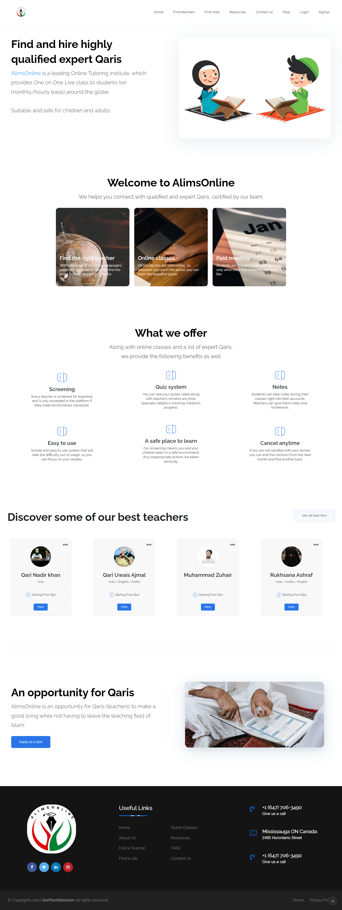
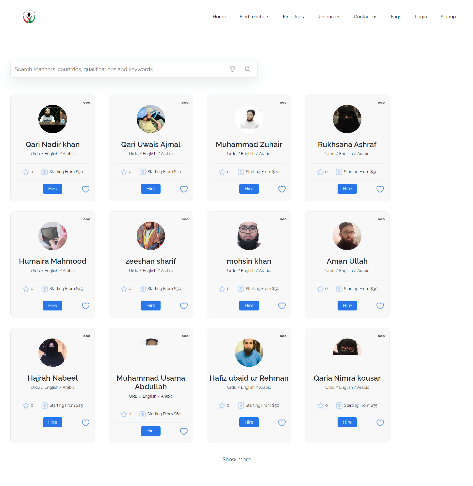
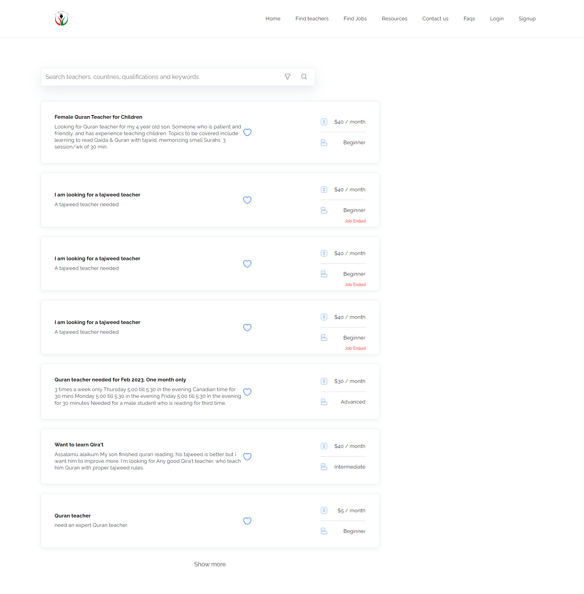
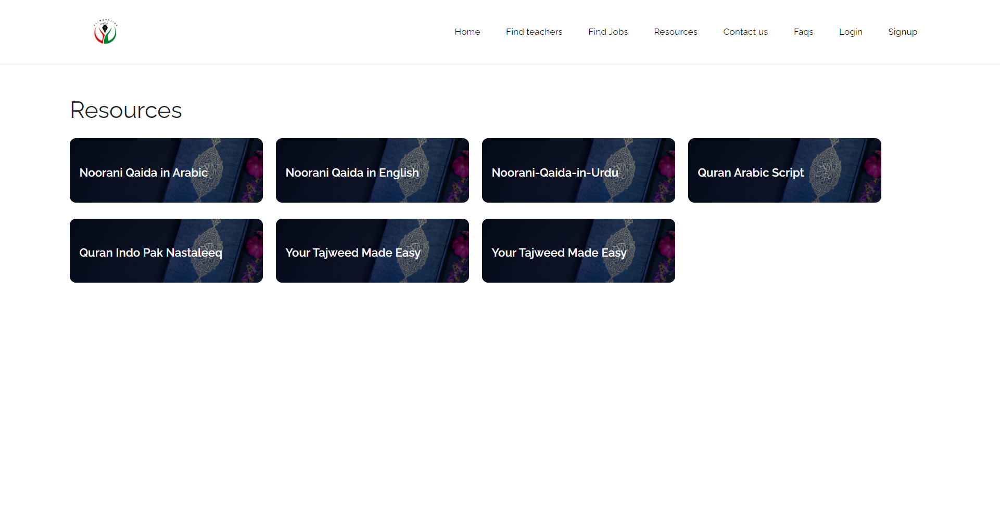
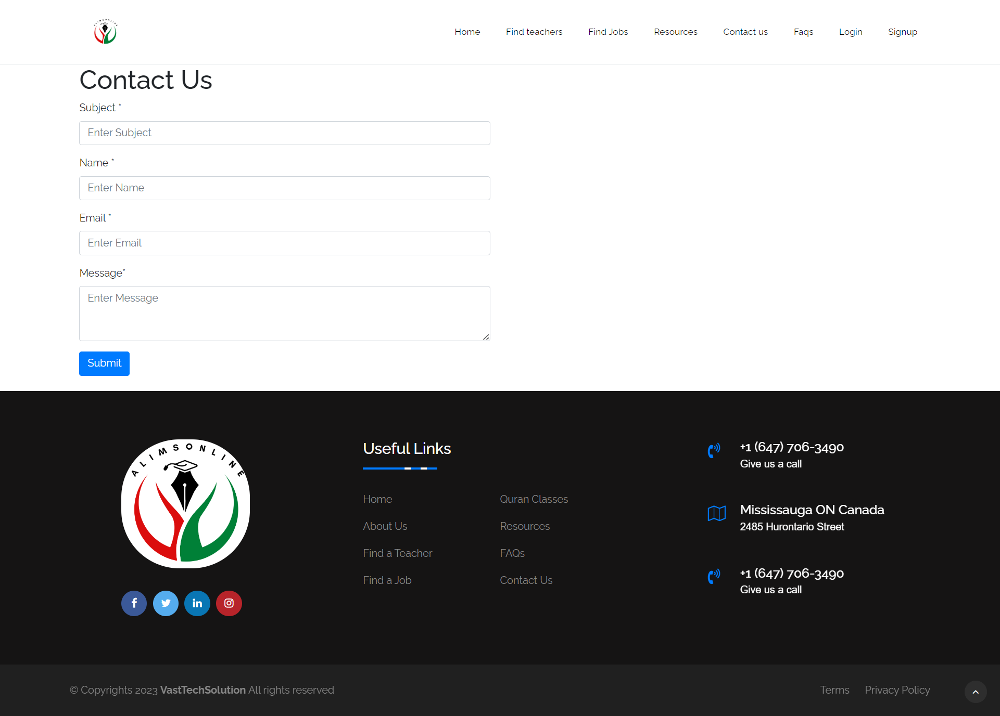
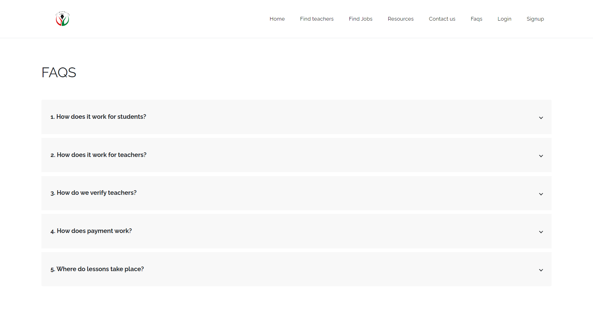
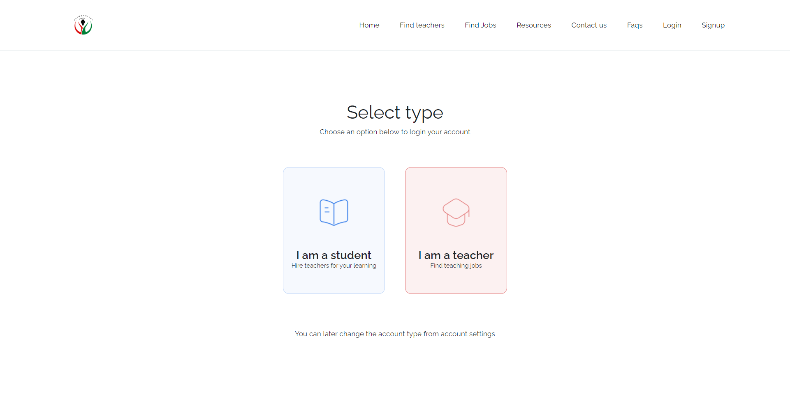
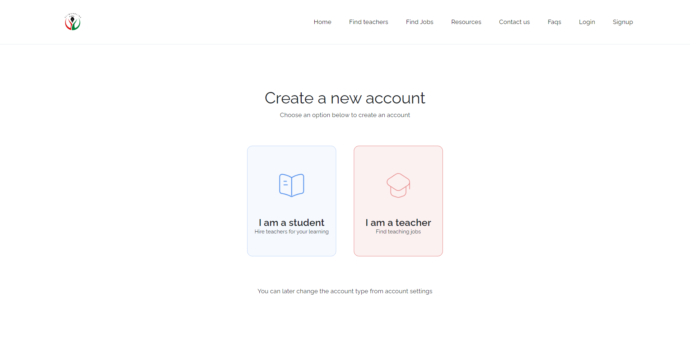

# Qari.io Clone - AlimsOnline
This repository contains a clone of the **Qari.io** website, an Online Tutoring Institute that offers One on One Live classes to students of all ages around the world. The website provides a safe and suitable platform for both children and adults to engage in learning through personalized tutoring.

### For Live Demo : [Click Here](https://lms-qari-clone.vercel.app/)


## Table of Contents

- [Qari.io Clone - AlimsOnline](#qariio-clone---alimsonline)
    - [For Live Demo : Click Here](#for-live-demo--click-here)
  - [Table of Contents](#table-of-contents)
  - [Screenshots](#screenshots)
    - [Home/Landing Page](#homelanding-page)
    - [Find Teachers Page](#find-teachers-page)
    - [Find a Teaching Job Page](#find-a-teaching-job-page)
    - [Resources Page](#resources-page)
    - [Contact Page](#contact-page)
    - [FAQ Page](#faq-page)
    - [Login Page](#login-page)
    - [Signup Page](#signup-page)
  - [How to Use](#how-to-use)
  - [Contributing](#contributing)
  - [Credits](#credits)
  - [License](#license)

## Screenshots

Here are the screenshots of different pages of the cloned website:

### Home/Landing Page


### Find Teachers Page


### Find a Teaching Job Page


### Resources Page


### Contact Page


### FAQ Page


### Login Page


### Signup Page


## How to Use

To explore the cloned website, follow these steps:

1. Clone the repository using the following command:

```shell
git clone https://github.com/your-username/alimsonline-clone.git
```

2. Open the cloned directory:
```shell
cd alimsonline-clone
```

3. Open any of the HTML files in a web browser to view the corresponding page.

## Contributing

Contributions are welcome! If you find any issues or want to add enhancements to the cloned website, feel free to create a pull request.

## Credits

This clone was created by [Adeel Hashmi](https://github.com/adeel-hashmi).


Original website: [Qari.io](https://qari.io/)

## License

This project is licensed under the [MIT License](LICENSE).

---

**Disclaimer:** This repository not created for commercial purposes. All rights for the original content, design, and branding belong to Qari.io.

---

